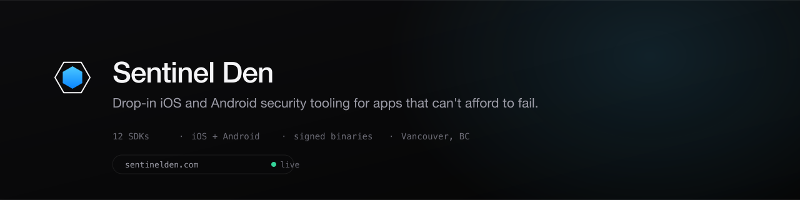

  

  <a href="https://sentinelden.com"><b>sentinelden.com</b></a> &nbsp;·&nbsp;
  <a href="https://sentinelden.com/docs">Docs</a> &nbsp;·&nbsp;
  <a href="https://sentinelden.com/blog">Engineering blog</a> &nbsp;·&nbsp;
  <a href="https://sentinelden.com/engineering">Engineering</a> &nbsp;·&nbsp;
  <a href="https://sentinelden.com/trust">Trust</a> &nbsp;·&nbsp;
  <a href="https://sentinelden.com/status">Status</a>

  
    12 SDKs, iOS and Android &nbsp;·&nbsp; code-signed <code>.xcframework</code> and SHA-256-verified <code>.aar</code>
    &nbsp;·&nbsp; zero third-party dependencies on iOS &nbsp;·&nbsp; independent, no outside funding
  

---

Vendor-grade iOS and Android security SDKs, binary-audit tooling, and engineering
writing, by [Muhammad Khan](https://github.com/iamuhammadkhan) from Vancouver,
British Columbia.

Every SDK ships as a code-signed `.xcframework` on iOS and a SHA-256-verified
`.aar` under `com.sentinelden` on Android, published under a registered Apple
Developer Team ID you can check yourself at
[/verify](https://sentinelden.com/verify). One idiomatic entry point, one typed
error surface, no swizzling in your release build. Learn one SDK and you know
all twelve, on either platform.

## What we ship

| | Product | What it does |
|---|---|---|
| **Runtime** | [RuntimeGuard](https://sentinelden.com/sdk/runtimeguard) | Jailbreak, debugger and dylib-injection detection, integrity attestation, App Attest cross-signing, risk-scored reports |
| | [BehaviorGuard](https://sentinelden.com/sdk/behaviorguard) | Continuous behavioral biometrics: touch dynamics, motion, keyboard rhythm, with on-device baseline learning |
| | [PresenceKit](https://sentinelden.com/sdk/presencekit) | NPU-pinned presence verification: liveness, gaze, face-region pinning beyond Face ID |
| **Data** | [PayloadGuard](https://sentinelden.com/sdk/payloadguard) | Multi-pin SPKI TLS validation plus ECDH and AES-256-GCM payload encryption above TLS, with replay-bound AAD |
| | [EnclaveVault](https://sentinelden.com/sdk/enclavevault) | Typed wrapper around the Secure Enclave and Android Keystore, with policy-drift refusal on bootstrap |
| | [RedactKit](https://sentinelden.com/sdk/redactkit) | On-device PII redaction across visual, audio and text, routed across the Neural Engine, GPU and CPU |
| **Surface** | [ScreenGuard](https://sentinelden.com/sdk/screenguard) | Capture protection, forensic HMAC watermarks, ReplayKit-bypass defenses |
| | [InputGuard](https://sentinelden.com/sdk/inputguard) | Secure keyboard, clipboard isolation, paste-source attestation |
| **Agents** | [AgenticGuard](https://sentinelden.com/sdk/agenticguard) | On-device LLM agent sandbox: typed tool registry, fail-closed intent verification, egress policy, hash-chained audit trail |
| | [IntentKit](https://sentinelden.com/sdk/intentkit) | Offline SLM intent engine, natural language to structured tool calls, Ed25519-signed model artifacts |
| | [AnomalyKit](https://sentinelden.com/sdk/anomalykit) | On-device anomaly detection across telemetry, sensors, acoustics and behavior |
| **Audit** | [ManifestGuard](https://sentinelden.com/sdk/manifestguard) | Debug-only privacy-manifest auditor, compiles to nothing in Release |
| | [SentinelDen Studio](https://sentinelden.com/audit) | Notarized macOS app auditing `.ipa`, `.app`, `.apk` and `.aab` against OWASP MASVS, with SARIF, CycloneDX SBOM and PDF output |

Source for the commercial products is closed. The integration references at
[sentinelden.com/docs](https://sentinelden.com/docs) cover the full API surface,
and every SDK publishes a [threat model](https://sentinelden.com/threat-model)
with its limits stated.

## Open source

**[xcprivacy-lint](https://github.com/sentinelden/xcprivacy-lint)** &nbsp;·&nbsp; MIT

A Swift CLI that validates an iOS `PrivacyInfo.xcprivacy` manifest against the
API surface a binary actually touches. To be straight about its state: the repo
is pre-v0.1 design scaffolding, and the validator it will expose ships embedded
in Studio today. Contributions welcome.

## Free tooling

**`sentinelctl`** &nbsp;·&nbsp; `brew install sentinelden/tap/sentinelctl`

The audit engine as a CLI. Reads `.ipa`, `.app`, `.apk` and `.aab`, writes SARIF,
CycloneDX SBOM, Markdown and issue-tracker JSON, and its exit code is a build
gate. Free at Community level, and it runs without a licence key.

## Writing

Seventy-plus technical posts at
[sentinelden.com/blog](https://sentinelden.com/blog), on the problems these SDKs
were built to solve. No vendor fluff. [RSS](https://sentinelden.com/rss.xml).

What it covers

 

- Jailbreak detection beyond `sysctl`, layered Frida detection, Mach-O integrity
- TLS pinning under cert rotation, payload encryption above TLS, defeating MITM
- Secure Enclave residency, `biometryCurrentSet` vs `biometryAny`, App Attest cross-signing
- On-device LLM agent sandboxing, prompt injection in production, Foundation Models tool-calling
- Offline SLM intent extraction, INT4 quantization budgets, MLX vs Core ML backend selection
- Continuous behavioral biometrics, NPU-pinned liveness, signals beyond Face ID
- On-device PII redaction across visual, audio and text on one policy surface
- Sensor and acoustic anomaly detection, Bayesian fusion across modalities
- OWASP MASVS on a real `.ipa`, macOS hardened-runtime entitlements, SARIF for CI

## Reach us

| | |
|---|---|
| Pre-sales, integration, licensing | [sentinelden.com/contact](https://sentinelden.com/contact) |
| Coordinated security disclosure | `security@sentinelden.com` ([policy](https://sentinelden.com/security)) |
| General | `mk@sentinelden.com` |
| Service status | [sentinelden.com/status](https://sentinelden.com/status) |

Based in Vancouver, British Columbia, Canada. Contracts under BC law, EU and UK
consumer-protection compliant. The website is the canonical surface for
everything we publish; this org is for code and PR collaboration.

Not affiliated with, endorsed by, or specifically approved by Apple Inc. See <a href="https://sentinelden.com/trademarks">trademarks</a>.

